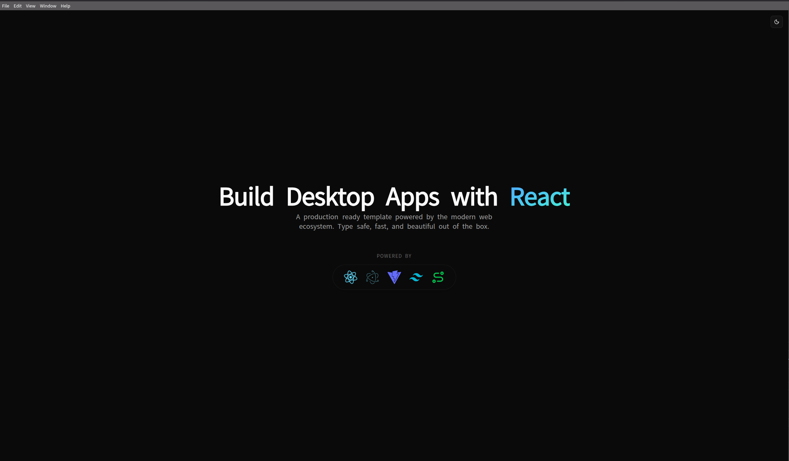

# ⚡️ React Electron Template

> A modern, type-safe Electron starter template with the latest technologies, pre-configured and ready for production.


## 🖼️ Preview



## 🚀 Why This Template?

Setting up a modern Electron app with current best tools and practices was **unnecessarily painful**. So I am putting this template out there to make it easier for others.

---

## 🛠️ Tech Stack

| Category | Technology | Version |
|----------|------------|---------|
| **Runtime** | ⚛️ Electron | 39.x |
| **Framework** | 💙 React | 19.x |
| **Language** | 📘 TypeScript | 5.x |
| **Bundler** | ⚡ Vite | 5.x |
| **Build Tool** | 🛠️ Electron Forge | 7.x |
| **Styling** | 🎨 TailwindCSS | 4.x |
| **Routing** | 🛣️ TanStack Router | 1.x |
| **UI Components** | 🧱 shadcn/ui | latest |
| **Icons** | 🎭 React Icons | latest |
| **API Layer** | ⚡ tRPC v11 | latest |


## 🏁 Quick Start

```bash
# Clone the template
git clone https://github.com/yourusername/react-electron-template.git my-app
cd my-app

# Install dependencies (using Bun is recommended 🥟)
bun install

# Start development 🚀
bun start
```

## 🏗️ Project Structure

```
src/
├── 🔌 main/
│   ├── main.ts                # Electron main process
│   └── trpc/
│       ├── context.ts         # tRPC context
│       ├── router.ts          # App router
│       └── trpc.ts            # tRPC init
├── 🌉 preload/
│   └── preload.ts             # Preload script (IPC bridge)
└── ⚛️ renderer/
    ├── renderer.tsx           # React entry point
    ├── routeTree.gen.ts       # Auto-generated route tree
    ├── 📂 routes/
    │   ├── __root.tsx          # App layout (like App.tsx)
    │   └── index.tsx           # Home page (/)
    ├── 🧱 components/
    │   ├── ui/                 # shadcn/ui components
    │   ├── theme-provider.tsx  # Dark mode context
    │   └── theme-toggle.tsx    # Theme switcher
    ├── 🔧 lib/
    │   ├── trpc.ts             # tRPC client + react-query
    │   └── utils.ts            # Utility functions (cn, etc.)
    └── 🎨 styles/
        └── global.css          # Tailwind + theme variables
```

---

## 🛣️ Adding Routes

Simply create a file in `src/renderer/routes/` and it becomes a route!

```tsx
// src/renderer/routes/settings.tsx → /settings
import { createFileRoute } from '@tanstack/react-router'

export const Route = createFileRoute('/settings')({
  component: Settings,
})

function Settings() {
  return <div>⚙️ Settings Page</div>
}
```

**Nested routes? Easy:**

- `src/renderer/routes/settings/index.tsx`    → `/settings`
- `src/renderer/routes/settings/profile.tsx`  → `/settings/profile`

## 🧱 Adding Components

We use **shadcn/ui**. Add components via CLI:

```bash
bunx --bun shadcn@latest add button
bunx --bun shadcn@latest add card dialog input
```

## ⚡ tRPC (Electron v11)

tRPC is wired up via **trpc-electron**. Entry points to review:

- `src/main/trpc/*` (router + context)
- `src/main/main.ts` (IPC handler in `app.whenReady()`)
- `src/preload/preload.ts` (bridge)
- `src/renderer/lib/trpc.ts` + `src/renderer/renderer.tsx` (client + providers)


## 🗺️ Migration Guide (Regular React)

Coming from a standard React project? Here's the map:

| Regular React | This Template |
|--------------|---------------|
| `src/main.tsx` | `src/renderer/renderer.tsx` |
| `src/App.tsx` | `src/renderer/routes/__root.tsx` |
| `src/pages/Home.tsx` | `src/renderer/routes/index.tsx` |
| `src/pages/About.tsx` | `src/renderer/routes/about.tsx` |

**Key Difference:** No manual router config—file location defines the route!

## ⚙️ Configuration Files

- `forge.config.ts` - Electron Forge config
- `vite.main.config.ts` - Main process Vite config
- `vite.renderer.config.ts` - Renderer Vite config
- `vite.preload.config.ts` - Preload Vite config
- `tsconfig.json` - TypeScript config
- `components.json` - shadcn/ui config

## 📄 License

MIT
